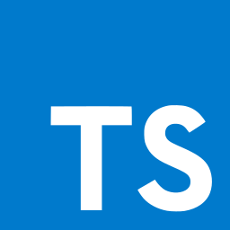
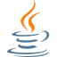
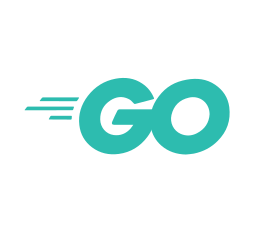
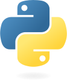

<h1 align="center">
  <div align="center">
      
      
      
      
      
  </div>
  OpenNext CDK
</h1>
<div align="center">
  <a href="https://github.com/datasprayio/open-next-cdk/actions?query=workflow%3A%22build%22">
    
  </a>
  <a href="https://github.com/datasprayio/open-next-cdk/blob/master/LICENSE">
    
  </a>
  <a href="https://www.npmjs.com/package/open-next-cdk">
    
  </a>
</div>
<h3 align="center">Deploy NextJS on AWS using CDK IaC and OpenNext packaging</h3>

### Contents

- [What is this?](#what-is-this)
- [Quickstart](#quickstart)
- [Advanced](#advanced)
    - [Pre-built OpenNext package](#pre-built-opennext-package)
    - [Additional security](#additional-security)
- [About](#about)
    - [Benefits](#benefits)
    - [Dependencies](#dependencies)
    - [Similar projects](#similar-projects)
- [Contributing](#contributing)
    - [Using Projen](#using-projen)

# What is this?

A building block for Amazon's infrastructure-as-code CDK toolkit to deploy a NextJS app using AWS serverless services.
Supported NextJs versions: >=12.3.0+ (includes 13.0.0+)

Your NextJS app is packaged using OpenNext to fit the serverless format on Lambda

# Quickstart

### NextJS setup

Add a dev dependency `esbuild@0.17.16` to your NextJS project.

```shell
npm install --save-dev esbuild@0.17.16
```

### CDK Construct

Use this construct in your CDK application to deploy your NextJS app to AWS.

<details>
  <summary> Typescript</summary>

  <a href="https://www.npmjs.com/package/open-next-cdk">
    
  </a>

  Install the dependency using npm:

  ```shell
  npm install --save-dev esbuild@0.17.16 open-next-cdk
  ```

  Use the construct in your CDK application:

  ```ts
  import { Nextjs } from 'open-next-cdk';

  new Nextjs(this, 'Web', {
    nextjsPath: './web', // relative path to nextjs project root
  });
  ```
</details>
<details>
  <summary> Java</summary>
  <a href="https://search.maven.org/artifact/io.dataspray/open-next-cdk">
    
  </a>

  Install the dependency using Maven:

  ```xml
  <dependency>
    <groupId>io.dataspray</groupId>
    <artifactId>open-next-cdk</artifactId>
    <version>x.y.z</version>
  </dependency>
  ```

  Use the construct in your CDK application:

  ```java
  Nextjs.Builder.create(this, getConstructId())
          .nextjsPath("./web")
          .build();
  ```
</details>
<details>
  <summary> Go</summary>

  <a href="https://github.com/datasprayio/open-next-cdk/tree/main/opennextcdk">
    
  </a>

  Install the dependency:

  ```shell
  go get github.com:datasprayio/open-next-cdk.git
  ```
</details>
<details>
  <summary> Python</summary>

  <a href="https://pypi.org/project/open-next-cdk/">
    
  </a>

  Install the dependency:

  ```shell
  pip install open-next-cdk
  ```
</details>
<details>
  <summary> .NET</summary>

  <a href="https://www.nuget.org/packages/Dataspray.OpenNextCdk">
    
  </a>

  Install the dependency:

  ```shell
  dotnet add package Dataspray.OpenNextCdk
  ```
</details>
<br/>

This will automatically build your NextJS app and package it for you as part of the CDK construct.

If you would prefer to package it separately, see below:

# Advanced

### Pre-built OpenNext package

<details>
  <summary>How-to</summary>

  You may also provide already pre-built OpenNext package directly by building it yourself first:

  ```shell
  open-next build
  ```

  You will find a new folder `.open-next` which contains the packaging for your NextJS App. Now you can use the construct by instructing it not to build your app, just use the OpenNext folder directly:

  ```ts
  import { Nextjs } from 'open-next-cdk';

  new Nextjs(this, 'Web', {
    nextjsPath: './web', // relative path to nextjs project containing .open-next folder
    isPlaceholder: true, // Do not build, assume .open-next folder already exists
  });
  ```
</details>

### Additional security
<details>
  <summary>How-to</summary>

  ```ts
  import { RemovalPolicy, Stack } from "aws-cdk-lib";
  import { Construct } from "constructs";
  import { CfnWebAcl } from "aws-cdk-lib/aws-wafv2";
  import { SecurityPolicyProtocol, type DistributionProps } from "aws-cdk-lib/aws-cloudfront";
  import { Nextjs, type NextjsDistributionProps } from "cdk-nextjs-standalone";
  import { Bucket, BlockPublicAccess, BucketEncryption } from "aws-cdk-lib/aws-s3";

  // Because of `WebAcl`, this stack must be deployed in us-east-1. If you want
  // to deploy Nextjs in another region, add WAF in separate stack deployed in us-east-1
  export class UiStack {
    constructor(scope: Construct, id: string) {
      const webAcl = new CfnWebAcl(this, "WebAcl", { ... });
      new Nextjs(this, "NextSite", {
        nextjsPath: "...",
        defaults: {
          assetDeployment: {
            bucket: new Bucket(this, "NextjsAssetDeploymentBucket", {
              autoDeleteObjects: true,
              removalPolicy: RemovalPolicy.DESTROY,
              encryption: BucketEncryption.S3_MANAGED,
              enforceSSL: true,
              blockPublicAccess: BlockPublicAccess.BLOCK_ALL,
            }),
          },
          distribution: {
            functionUrlAuthType: FunctionUrlAuthType.AWS_IAM,
            cdk: {
              distribution: {
                webAclId: webAcl.attrArn,
                minimumProtocolVersion: SecurityPolicyProtocol.TLS_V1_2_2021,
              } as DistributionProps,
            },
          } satisfies Partial<NextjsDistributionProps>,
        },
      });
    }
  }
  ```

</details>
<br />

# About

Deploys a NextJs static site with server-side rendering and API support. Uses AWS lambda and CloudFront.

There is a new (since Next 12) [standalone output mode which uses output tracing](https://nextjs.org/docs/advanced-features/output-file-tracing) to generate a minimal server and static files.
This standalone server can be converted into a CloudFront distribution and a lambda handler that handles SSR, API, and routing.

The CloudFront default origin first checks S3 for static files and falls back to an HTTP origin using a lambda function URL.

## Benefits

This approach is most compatible with new NextJs features such as ESM configuration, [middleware](https://nextjs.org/docs/advanced-features/middleware), next-auth, and React server components ("appDir").

The unmaintained [@serverless-nextjs project](https://github.com/serverless-nextjs/serverless-next.js) uses the deprecated `serverless` NextJs build target which [prevents the use of new features](https://github.com/serverless-nextjs/serverless-next.js/pull/2478).
This construct was created to use the new `standalone` output build and newer AWS features like lambda function URLs and fallback origins.

You may want to look at [Serverless Stack](https://sst.dev) and its [NextjsSite](https://docs.sst.dev/constructs/NextjsSite) construct for an improved developer experience if you are building serverless applications on CDK.

## Dependencies

Built on top of [open-next](https://open-next.js.org/), which was partially built using the original core of cdk-nextjs-standalone.

## Similar projects

### Heavily based on

- [Open-next](https://open-next.js.org/)
- <https://github.com/iiroj/iiro.fi/commit/bd43222032d0dbb765e1111825f64dbb5db851d9>
- <https://github.com/sladg/nextjs-lambda>
- <https://github.com/serverless-nextjs/serverless-next.js/tree/master/packages/compat-layers/apigw-lambda-compat>
- [Serverless Stack](https://github.com/serverless-stack/sst)
  - [RemixSite](https://github.com/serverless-stack/sst/blob/master/packages/resources/src/NextjsSite.ts) construct
  - [NextjsSite](https://github.com/serverless-stack/sst/blob/master/packages/resources/src/RemixSite.ts) construct

### Fork from cdk-nextjs
This project has been initially forked from [cdk-nextjs](https://github.com/jetbridge/cdk-nextjs) in order to [publish the package to other langugages](https://github.com/jetbridge/cdk-nextjs/issues/120#issuecomment-1634926223) including Java, Go, .NET, Python using JSII.

# Contributing

Hey there, we value every new contribution a lot 🙏🏼 thank you. Open an issue or a PR and we'll gladly help you out.

## Using Projen
Most boilerplate files are pre-generated including package.json. Don't update it directly, rather update `.projenrc.js` then run `yarn projen` to re-generate the files.

